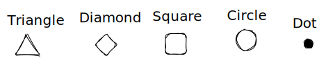
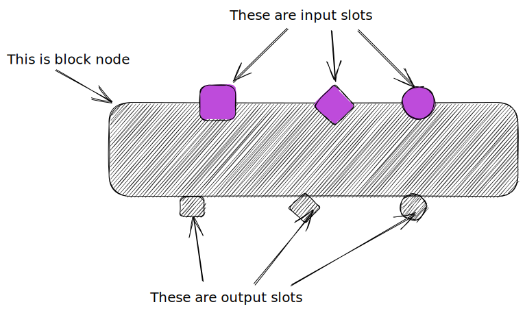
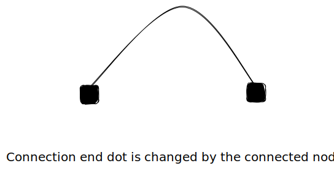

# Some idea

## Category 1

Only have output connection.

1. Circle
2. Square
3. Dot
4. Triangle
5. Diamond

## Category 2

Have both output slots(multiple output) and input slots(multiple inputs).

Output slot is floating on the edge of node, and can be stick to other connections(input slot or connection dot node)

## Category 3

Connection, used to connect nodes that both belongs to category 2.

